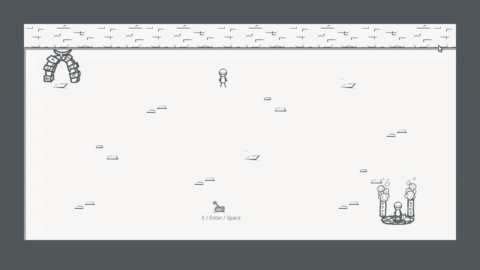

# Codename Indigo

## What is This?
The first project created through an open development collaboration among [Game Dev League](https://discordapp.com/invite/gamedev) members over the month of April.

## About the game
It will be a 2d top down adventure game where the player must overcome challenges on a series of floors as they climb the Ascension Tower. Primary gameplay consists of exploration, dialogue interaction and simple puzzle solving.

The original premise is:
> Climb the Ascension Tower, a mighty place of power, with your childhood friend. Each floor will challenge you with a unique puzzle. How far will you go to fulfill your dream?

## Process

The direction of the game is decided by a democratic process among the members. Discussion will be in threaded form via [issues](https://github.com/GDL-Collaborators/indigo/issues).

In the case of community votes the reactions will be tallied as total :+1:s minus :-1:s. The project lead will cast only tie breaking votes.

## Getting Started
* [Have a look at the roadmap](https://github.com/GDL-Collaborators/indigo/projects/2)
* [Check out the open issues](https://github.com/GDL-Collaborators/indigo/issues)
* Contribute to development! See below.

## Contributing
**Important**: By contributing to the project to agree to release your work under the [project license](#License) below.

You will need:
* [Godot engine v3.2.1](https://godotengine.org/download)
* [Git](https://git-scm.com/)

First make sure you can open the existing project:
1. Fork this repository using the button at the top
2. Make a local copy by cloning your new fork
3. Add the `src` folder inside of your copy to your Godot projects list for editing

Next add your work to the project, then when you're finished:
1. Add and commit the changes using git
2. Push your changes back to your fork
3. Create a pull request describing your changes

## License

All code and assets are provided under the terms of the [Creative Commons Attribution-ShareAlike 4.0](http://creativecommons.org/licenses/by-sa/4.0/) license.

## Credits
Tristan Shelton - GFX, Scripts
Jason Beetham - VFX, Shaders
Danny Webbie - Scripting, Gameplay, GFX
Collectivenectar - Music, SFX
Xahellz - Concept, Design
KMC - Design, Gameplay

See [CREDITS](CREDITS.md) for details.

